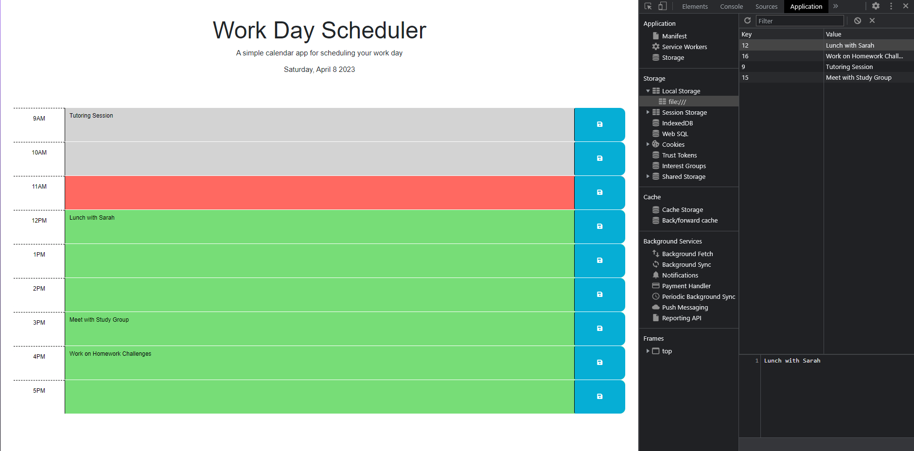

# Work Day Scheduler Challenge

## Description

In this challenge we were tasked with using jQuery to create a scheduler for users to plan their workday. This application was designed to store events through local storage for the average 9-to-5 work day and to retrieve that data for users even if they close that page. Through this application users can more efficiently plan and mangae their events for the day. As a developer, I was able to practice key concepts such as: local storage, jQuery, dayjs, and the remove/addClass methods.

## Installation

N/A

## Usage

Attached is an image of the application with its functionality.

[Deployed Application](https://nmatos12.github.io/work_day_scheduler/)

## Credits

[Rutger University](https://git.bootcampcontent.com/Rutgers-University/RUT-VIRT-FSF-FT-02-2023-U-LOLC)

[Instuctor Videos: JD Tadlock](https://gist.github.com/jdtdesigns/9cfe05400063902e46aa5f6faabff0ca)

Tutoring on 4/8/23 with Carlin Shaw:
- Helped with getting local storage functionality to work.

## License

MIT License

Copyright (c) [2023] [Matos, Natalie]

Permission is hereby granted, free of charge, to any person obtaining a copy of this software and associated documentation files (the "Software"), to deal in the Software without restriction, including without limitation the rights to use, copy, modify, merge, publish, distribute, sublicense, and/or sell copies of the Software, and to permit persons to whom the Software is furnished to do so, subject to the following conditions:

The above copyright notice and this permission notice shall be included in all copies or substantial portions of the Software.

THE SOFTWARE IS PROVIDED "AS IS", WITHOUT WARRANTY OF ANY KIND, EXPRESS OR IMPLIED, INCLUDING BUT NOT LIMITED TO THE WARRANTIES OF MERCHANTABILITY, FITNESS FOR A PARTICULAR PURPOSE AND NONINFRINGEMENT. IN NO EVENT SHALL THE AUTHORS OR COPYRIGHT HOLDERS BE LIABLE FOR ANY CLAIM, DAMAGES OR OTHER LIABILITY, WHETHER IN AN ACTION OF CONTRACT, TORT OR OTHERWISE, ARISING FROM, OUT OF OR IN CONNECTION WITH THE SOFTWARE OR THE USE OR OTHER DEALINGS IN THE SOFTWARE.
